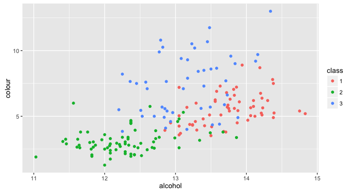
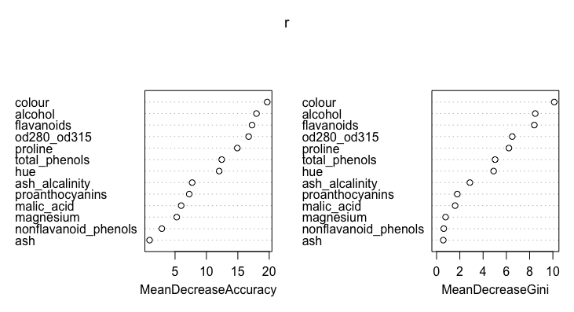
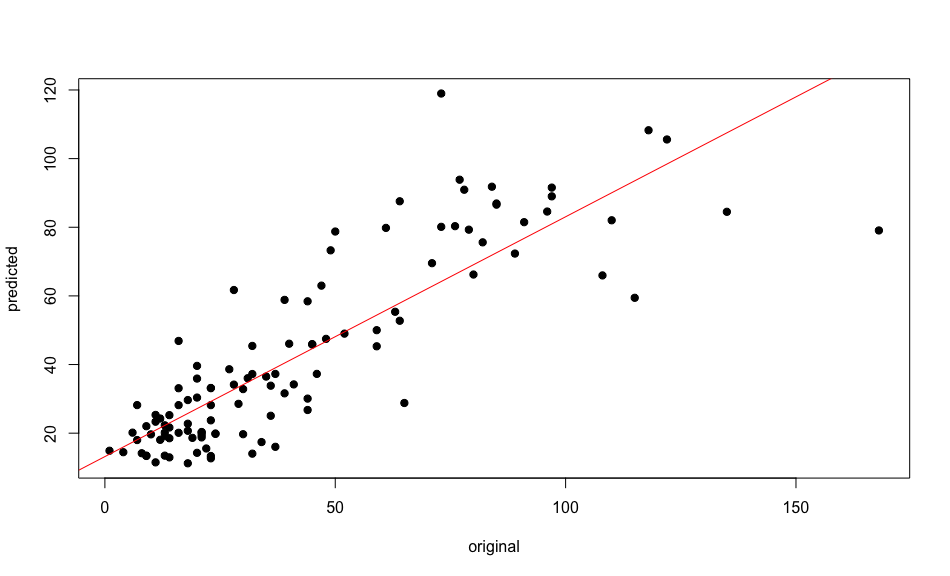
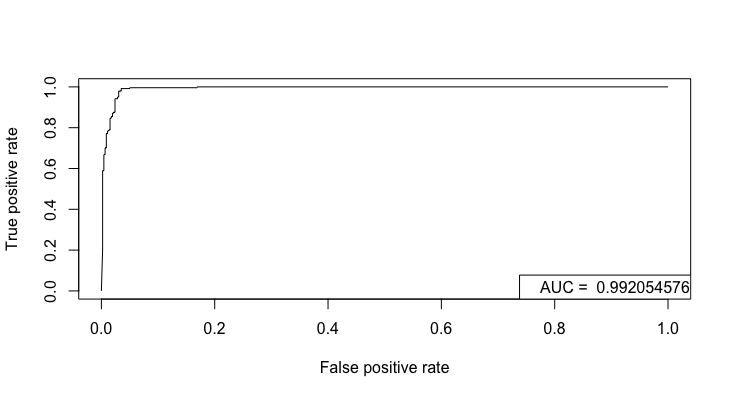

Table of Contents
=================

* [Random Forest](#random-forest)
* [Terminology](#terminology)
* [Random Forest in more detail](#random-forest-in-more-detail)
* [An example classifying wines](#an-example-classifying-wines)
* [Regression](#regression)
* [Random Forest on breast cancer data](#random-forest-on-breast-cancer-data)
* [Proximity](#proximity)
* [Parallelisation](#parallelisation)
* [Technical points](#technical-points)
* [Further reading](#further-reading)

Created by [gh-md-toc](https://github.com/ekalinin/github-markdown-toc)

# Random Forest

The Random Forest approach is an ensemble learning method based on many
[decision trees](https://en.wikipedia.org/wiki/Decision_tree). I have
[written](http://davetang.org/muse/2013/03/12/building-a-classification-tree-in-r/)
about decision trees but in essence you can think of a decision tree as a flow
chart where you make decisions based on a set of criteria. To illustrate the
process of building a Random Forest classifier, consider a two-dimensional
dataset with `N` cases (rows) that has `M` variables (columns). The Random
Forest algorithm will build independent decision trees but only using a random
subset of the data. For each tree, a random subset of `n` cases is sampled from
all available `N` cases; the cases not used in the tree construction are called
the Out Of Bag (OOB) cases. In addition, at each node (decision point) of a
tree, a random number of `m` variables is used from all available `M`
variables. The number of `m` variables to use is important and typically the
square root of `M` is used, e.g. with 100 variables, only 10 is used in each
individual decision tree. Once a set of independent trees have been constructed
(the default number of trees is 500 in the `randomForest` R package), a new
case can be classified by applying it each tree and collecting the final
classification result. For example if 500 trees were built, there would be 500
individual classifications. The final step is to average the results (called
majority voting) and the major classification is assigned to the new case.

More details are provided [below](#random-forest-in-more-detail).

# Terminology

Before we get into more details, make sure you understand the following terms,
which were adapted from the glossary of [Machine learning applications in
genetics and genomics](http://www.ncbi.nlm.nih.gov/pubmed/25948244).

* Features / predictors / independent variables are single measurements or
  descriptors of examples used in a machine learning task. For a person, age,
  height, weight, etc. are all individual features.
* Labels / classes are the targets of a prediction task; using our person
example, we may want to predict whether they like basketball. In
classification, the label is discrete (for example, 'likes basketball' or
'dislikes'); in regression, the label is a real value (for example, predicting
a person's height).
* Feature selection refers to the process of choosing a smaller set of features
from a larger set, either before applying a machine learning method or as part
of training. For example removing useless features (features with little to no
variance) or correlated features.
* Sensitivity (also known as recall) refers to the fraction of positive
examples identified; it is calculated by taking the number of positive
predictions that are correct and dividing them by the total number of positive
examples.
* Precision refers to the fraction of positive predictions that are correct; it
is calculated by the number of positive predictions that are correct divided by
the total number of positive predictions.
* The Precision-recall curve is a curve that plots precision (y-axis) against
recall (x-axis) at various classification thresholds and is used for binary
classifiers.

# Random Forest in more detail

The main idea behind the Random Forest approach was outlined at the
[start](#random-forest); this section provides a bit more detail.

The name Random Forest is nice because it describes the method; a forest is
made up of trees and these trees are randomly build. For a given dataset, a
random subset (using [bootstrap
resampling](https://en.wikipedia.org/wiki/Bootstrapping_(statistics))) is used
to build a decision tree and this sample is typically half of the dataset. This
process is repeated again to create a second random subset that is used to
build a second decision tree. Since these are random subsets, the predictions
made by the second tree could be different from the first tree. In the end, we
will have hundreds of trees (a forest) that were built from a slightly
different subset of the dataset and each generating (potentially) different
predictions.

To add more randomness to the trees, a subset of features/predictors/variables
are used to produce a split in the decision trees. For example, if there were
100 predictors, a random subset of 10 will be used at each node to define the
best split, instead of the full set of 100. Note that a *new random subset of
predictors are used at each node*; this is different from selecting a random
subset of predictors and using that random subset to build the entire tree. The
number of predictors to consider at each node is a key parameter and it is
recommended that empirical tests (i.e. model tuning) be conducted to find the
best value; the square root of the number of available predictors is usually
recommended as a good starting point. Finally, majority voting (i.e. averaging)
is used to combine all the separate predictions made by the individual trees.

Typically in machine learning/predictive modelling, a subset of data is "held
out" and used for model validation since this holdout data was not used in
training the model. Each tree in the random forest was built using a random
subset and thus we automatically have holdout data for that particular tree;
this is known as "Out Of Bag" (OOB) data. Every case in the full dataset will
be _in bag_ for some trees and _out of bag_ for other trees; this can be used
to evaluate the Random Forest classifier. For example, if a particular case,
`x`, was used in 250 trees and not used in another 250 trees, we can apply `x`
to the trees that did not use it for training. Since `x` was never used to
generate any of the 250 trees, the result provides an assessment of the
reliability of the Random Forest classifier. This can be carried out across all
the cases in the dataset. Due to this OOB feature in the Random Forest
algorithm, we do not need to create an additional holdout or testing dataset as
pointed out in the
[paper](https://www.stat.berkeley.edu/~breiman/randomforest2001.pdf) describing
the Random Forest approach:

>Therefore, using the out-of-bag estimate removes the need for a set aside test set.

The Random Forest method also provides a measure of how close each case is to
another case in the dataset, which is known as the "proximity". The procedure
for calculating the proximity of two cases is to drop a pair of records down
each individual tree in a Random Forest, and counting the number of times the
two cases end up at the same terminal node, i.e. the same classification, and
dividing by the number of trees tested. By carrying out this step across all
pairs of cases, a proximity can be constructed. The proximity matrix provides
a measure of how similar any two cases are in a dataset and can be used with
hierarchical clustering to examine the underlying structure of a dataset.

Another useful feature of the Random Forest method is its estimation of
relative predictor importance. The method is based on measuring the effect of
the classifier if one of the predictors was removed. This is performed by
randomly scrambling the values associated to a given predictor; the scrambling
is done by moving values from a specific row to another row. The scrambling is
performed one predictor at a time (the data is re-scrambled for each predictor
being tested) and predictive accuracy is measured to obtain an estimation of
relative predictor importance. If the performance of the classifier is
unaffected by the scrambling then the predictor is relatively unimportant. In
contrast, if the scrambling caused a decrease in performance, then it is
relative important.

# An example classifying wines

Refer to the R Markdown file,
[random_forest.Rmd](https://github.com/davetang/learning_random_forest/blob/master/random_forest.Rmd),
for more information.

* Classifying wines from this [dataset](http://archive.ics.uci.edu/ml/datasets/Wine).
* There are 13 features/predictors/variables, which are the results of a chemical analysis of wines
* There are three labels, representing three different [cultivars](https://en.wikipedia.org/wiki/Cultivar)
* We can build a Random Forest classifier to classify wines based on their 13 features
* Related blog post <http://davetang.org/muse/2012/12/20/random-forests-in-predicting-wines/>

```r
install.packages("randomForest")
library(randomForest)

# preparing the data
data_url <- 'http://archive.ics.uci.edu/ml/machine-learning-databases/wine/wine.data'
df <- read.table(file=url(data_url), header=FALSE, sep=",")
header <- c('class',
            'alcohol',
            'malic_acid',
            'ash',
            'ash_alcalinity',
            'magnesium',
            'total_phenols',
            'flavanoids',
            'nonflavanoid_phenols',
            'proanthocyanins',
            'colour',
            'hue',
            'od280_od315',
            'proline')
names(df) <- header
df$class <- as.factor(df$class)

# analysis
# install if necessary
# install.packages("randomForest")
library(randomForest)

set.seed(31)
my_sample <- sort(sample(x = 1:nrow(df), replace = FALSE, size = nrow(df)/2))
my_sample_comp <- setdiff(1:nrow(df), my_sample)

test <- df[my_sample, ]
train <- df[my_sample_comp, ]

r <- randomForest(class ~ ., data=train, importance=TRUE, do.trace=100)

# plots
# install if necessary
# install.packages(ggplot2)
library(ggplot2)
class_1_importance <- data.frame(feature=names(r$importance[,1]), importance=r$importance[,1])
ggplot(class_1_importance, aes(x=feature, y=importance)) + geom_bar(stat="identity")

class_2_importance <- data.frame(feature=names(r$importance[,2]), importance=r$importance[,2])
ggplot(class_2_importance, aes(x=feature, y=importance)) + geom_bar(stat="identity")

class_3_importance <- data.frame(feature=names(r$importance[,3]), importance=r$importance[,3])
ggplot(class_2_importance, aes(x=feature, y=importance)) + geom_bar(stat="identity")

boxplot(df$colour ~ df$class, main="Colour by class")
boxplot(df$alcohol ~ df$class, main="Alcohol by class")

ggplot(df, aes(x=alcohol, y=colour, colour=class)) + geom_point()
```



Predictor importance.

```r
varImpPlot(r)
```



# Regression

Random Forest can be used for regression tasks, i.e. making numerical
predictions, as well as classification. The example below uses the `airquality`
dataset that comes with R.

```r
library(randomForest)

data(airquality)
head(airquality)
#   Ozone Solar.R Wind Temp Month Day
# 1    41     190  7.4   67     5   1
# 2    36     118  8.0   72     5   2
# 3    12     149 12.6   74     5   3
# 4    18     313 11.5   62     5   4
# 5    NA      NA 14.3   56     5   5
# 6    28      NA 14.9   66     5   6

# following the example from ?randomForest
ozone.rf <- randomForest(Ozone ~ ., data=airquality, mtry=3, importance=TRUE, na.action=na.omit)
print(ozone.rf)
# 
# Call:
#  randomForest(formula = Ozone ~ ., data = airquality, mtry = 3,      importance = TRUE, na.action = na.omit) 
#                Type of random forest: regression
#                      Number of trees: 500
# No. of variables tried at each split: 3
# 
#           Mean of squared residuals: 303.8304
#                     % Var explained: 72.31

# predicted values
predicted <- ozone.rf$predicted

# original values
# not all the original values were predicted
# hence we need to subset based on what was predicted
original  <- airquality$Ozone[sort(as.numeric(names(ozone.rf$predicted)))]

# fit a linear model
# Y ~ X, where Y is the dependent variable and X is the independent variable
fit       <- lm(predicted~original)
summary(fit)
#
# Call:
# lm(formula = predicted ~ original)
# 
# Residuals:
#     Min      1Q  Median      3Q     Max 
# -51.512  -7.919  -1.074   6.660  54.777 
# 
# Coefficients:
#             Estimate Std. Error t value Pr(>|t|)    
# (Intercept)  13.1775     2.2126   5.956 3.22e-08 ***
# original      0.6988     0.0413  16.919  < 2e-16 ***
# ---
# Signif. codes:  0 ‘***’ 0.001 ‘**’ 0.01 ‘*’ 0.05 ‘.’ 0.1 ‘ ’ 1
# 
# Residual standard error: 14.41 on 109 degrees of freedom
# Multiple R-squared:  0.7242,	Adjusted R-squared:  0.7217 
# F-statistic: 286.3 on 1 and 109 DF,  p-value: < 2.2e-16

plot(original, predicted, pch=19)
abline(fit, col=2)
```



# Random Forest on breast cancer data

```r
library(randomForest)

data_url <- 'http://archive.ics.uci.edu/ml/machine-learning-databases/breast-cancer-wisconsin/breast-cancer-wisconsin.data'
df <- read.table(file=url(data_url), header=FALSE, sep=',')

colnames(df) <- c('sample_code_number',
                  'clump_thickness',
                  'uniformity_of_cell_size',
                  'uniformity_of_cell_shape',
                  'marginal_adhesion',
                  'single_epithelial_cell_size',
                  'bare_nuclei',
                  'bland_chromatin',
                  'normal_nucleoli',
                  'mitoses',
                  'class')

# remove sample code number
df <- df[,-1]

# change the class
# 2 for benign will be 0 and
# 4 for malignant will be 1
df$class <- factor(ifelse(df$class==4, 1, 0))

r <- randomForest(class ~ ., data=df, importance=TRUE, proximity=TRUE)

print(r)
# 
# Call:
#  randomForest(formula = class ~ ., data = df, importance = TRUE,      proximity = TRUE, do.trace = 100) 
#                Type of random forest: classification
#                      Number of trees: 500
# No. of variables tried at each split: 3
# 
#         OOB estimate of  error rate: 3.15%
# Confusion matrix:
#     0   1 class.error
# 0 443  15  0.03275109
# 1   7 234  0.02904564

library(ROCR)

# use votes, which are the fraction of (OOB) votes from the random forest
# in the first row, all trees voted for class 0, which is benign
head(r$votes)
#           0          1
# 1 1.0000000 0.00000000
# 2 0.1222222 0.87777778
# 3 1.0000000 0.00000000
# 4 0.1123596 0.88764045
# 5 0.9940828 0.00591716
# 6 0.0000000 1.00000000

pred <- prediction(r$votes[,2], as.numeric(df$class)-1)
perf <- performance(pred,"tpr","fpr")
plot(perf)

# Area under the curve
auc <- performance(pred, measure = "auc")
auc@y.values

legend('bottomright', legend = paste("AUC = ", auc@y.values))
```



# Proximity

Proximity is calculated by tallying the number of times a pair of records ends
up at the same terminal node for each tree.

```r
library(randomForest)

data_url <- 'http://archive.ics.uci.edu/ml/machine-learning-databases/letter-recognition/letter-recognition.data'
df <- read.table(file=url(data_url), header=FALSE, sep=',')
colnames(df) <- c('class', 'xbox', 'ybox', 'width', 'high', 'onpix', 'xbar', 'ybar', 'x2bar', 'y2bar', 'xybar', 'x2ybr', 'xy2br', 'xege', 'xegvy', 'yege', 'yegvx')
r <- randomForest(class ~ ., data=df, importance=TRUE, proximity=TRUE)

# proximity matrix
mat <- r$proximity
# name the rows and columns
rownames(mat) <- df$class
colnames(mat) <- df$class

# use the which() function to calculate a
# matrix of which elements in the proximity matrix
# are greater than 0.5 but not 1
w <- which(mat > 0.5 & mat != 1, arr.ind = TRUE)

# function to retrieve row and column names
# from the w matrix
get_row_col <- function(x, m){
  my_row <- rownames(m)[x[1]]
  my_col <- colnames(m)[x[2]]
  paste(my_row, my_col, sep = ':')
}

table(unname(apply(w, 1, get_row_col, m=mat)))

#    A:A    A:G    B:B    B:H    C:C    D:D    D:H    D:O    E:E    E:G    E:K    E:L    E:S    E:Z    F:F    F:P    G:A 
# 191944      1  14124      1  26514  10512     18      2  28560      4      1      2      1      1  18276     13      1 
#    G:E    G:G    H:B    H:D    H:H    H:K    I:I    I:J    J:I    J:J    K:E    K:H    K:K    K:R    K:X    L:E    L:L 
#      4  10492      1     18  26694      4  81548     18     18  61394      1      4  13878      2      1      2 109546 
#    M:M    M:V    N:N    O:D    O:O    O:Q    P:F    P:P    Q:O    Q:Q    Q:Z    R:K    R:R    S:E    S:S    T:T    T:Y 
#  49488      3  41938      2  12528      7     13  37994      7   6286      1      2  13730      1  10212  42168     13 
#    U:U    V:M    V:V    V:W    V:Y    W:V    W:W    X:K    X:X    Y:T    Y:V    Y:Y    Z:E    Z:Q    Z:Z 
#  77194      3  48160      7    103      7  52370      1  18088     13    103  23840      1      1  55088
```

Out of all the mismatches, V's and Y's tended to end up together the most often.

# Parallelisation

There is a `combine` function in the `randomForest` package that
combines two or more ensembles of trees into one. Therefore, we can
train ensembles in parallel and combine them! This is useful for large
datasets or for testing different parameters.

Install the required packages if missing and then load them.

``` r
.libPaths('/packages')
my_packages <- c('randomForest', 'foreach', 'doParallel', 'parallel', 'doRNG')

for (my_package in my_packages){
   if(!require(my_package, character.only = TRUE)){
      install.packages(my_package, '/packages')
      library(my_package, character.only = TRUE)
   }
}
```

## Load data

We will use the [Letter Recognition Data
Set](https://archive.ics.uci.edu/ml/datasets/Letter+Recognition) which
has 20,000 cases, 16 features, and 26 labels.

``` r
my_url <- 'https://archive.ics.uci.edu/ml/machine-learning-databases/letter-recognition/letter-recognition.data'
my_df <- read.table(file=url(my_url), header=FALSE, sep=',')
colnames(my_df) <- c('class', 'xbox', 'ybox', 'width', 'high', 'onpix', 'xbar', 'ybar', 'x2bar', 'y2bar', 'xybar', 'x2ybr', 'xy2br', 'xege', 'xegvy', 'yege', 'yegvx')
my_df$class <- factor(my_df$class, levels = LETTERS)

dim(my_df)
```

    ## [1] 20000    17

``` r
table(my_df$class)
```

    ## 
    ##   A   B   C   D   E   F   G   H   I   J   K   L   M   N   O   P   Q   R   S   T 
    ## 789 766 736 805 768 775 773 734 755 747 739 761 792 783 753 803 783 758 748 796 
    ##   U   V   W   X   Y   Z 
    ## 813 764 752 787 786 734

## Metrics

Write a function to calculate metrics.

``` r
metric <- function(rf, type = "accuracy"){
   # not used for now
   # tab <- table(rf$y, rf$predicted)
   # accuracy <- (TP + TN) / (TP + FN + FP + TN)
   # precision <- TP / (TP + FP)
   # recall <- TP / (TP + FN)
   # specificity <- TN / (TN + FP)
   if(type == "accuracy"){
      return(sum(rf$predicted == rf$y) / length(rf$y))
   } else {
      return(NULL)
   }
}
```

## Training

Train random forests model with 2,000 trees without parallelisation.

``` r
set.seed(1984)
my_time <- system.time(
   my_rf <- randomForest(
      class ~ .,
      data = my_df,
      ntree = 2000
   )
)

my_time
```

    ##    user  system elapsed 
    ##  80.772   6.143  87.121

``` r
metric(my_rf)
```

    ## [1] 0.96935

Train random forests with 2,000 trees in parallel. Note the line of code
`registerDoRNG(seed = 1984)`: this is to ensure that we train the same
model even with parallelisation.

``` r
cl <- makeCluster(10)
registerDoParallel(cl)
registerDoRNG(seed = 1984)

my_time_par <- system.time(
   my_rf_par <- foreach(
      ntree = rep(200, 10),
      .combine = combine,
      .packages = 'randomForest'
   ) %dopar% {
      randomForest(class ~ ., data = my_df, ntree=ntree)
   }
)
stopCluster(cl)

my_time_par
```

    ##    user  system elapsed 
    ##   5.357   4.252  19.719

``` r
metric(my_rf_par)
```

    ## [1] 0.9696

[Set
`.multicombine = TRUE`](https://stackoverflow.com/questions/14106010/parallel-execution-of-random-forest-in-r)
to further increase the speed up. As per the
[documentation](https://cran.r-project.org/web/packages/foreach/foreach.pdf),
the `.multicombine` argument is a:

> logical flag indicating whether the .combine function can accept more
> than two arguments. If an arbitrary .combine function is specified, by
> default, that function will always be called with two arguments. If it
> can take more than two arguments, then setting .multicombine to TRUE
> could improve the performance. The default value is FALSE unless the
> .combine function is cbind, rbind, or c, which are known to take more
> than two arguments.

``` r
cl <- makeCluster(10)
registerDoParallel(cl)
registerDoRNG(seed = 1984)

my_time_par_mc <- system.time(
   my_rf_par_mc <- foreach(
      ntree = rep(200, 10),
      .combine = combine,
      .multicombine = TRUE,
      .packages = 'randomForest'
   ) %dopar% {
      randomForest(class ~ ., data = my_df, ntree=ntree)
   }
)
stopCluster(cl)

my_time_par_mc
```

    ##    user  system elapsed 
    ##   1.551   1.084  12.873

``` r
metric(my_rf_par_mc)
```

    ## [1] 0.9696

As noted in the
[documentation](https://cran.r-project.org/web/packages/randomForest/randomForest.pdf)
in the `combine` section:

> The confusion, err.rate, mse and rsq components (as well as the
> corresponding components in the test compnent, if exist) of the
> combined object will be NULL.

But we can calculate those ourselves, if we want.

``` r
# confusion matrix, not run
# table(my_df$class, my_rf_par_mc$predicted)

setdiff(names(my_rf), names(my_rf_par_mc))
```

    ## [1] "err.rate"  "confusion"

Most predictions are the same between the model trained without and with
parallelisation.

``` r
table(my_rf$predicted == my_rf_par_mc$predicted)
```

    ## 
    ## FALSE  TRUE 
    ##    98 19902

## Tuning

Check accuracy as a function of the number of trees.

``` r
my_models <- list()
my_time_ntree <- system.time(
   for(n in seq(from = 500, to = 2000, by = 500)){
      set.seed(1984)
      my_rf <- randomForest(
         class ~ .,
         data = my_df,
         ntree = n
      )
      my_models[[paste0("ntree_", n)]] <- my_rf
   }
)

my_time_ntree
```

    ##    user  system elapsed 
    ## 199.319   7.435 207.239

``` r
sort(sapply(my_models, metric))
```

    ##  ntree_500 ntree_2000 ntree_1000 ntree_1500 
    ##    0.96925    0.96935    0.96945    0.96955

Check accuracy as a function of the number of trees in parallel.

``` r
cl <- makeCluster(4)
registerDoParallel(cl)
registerDoRNG(seed = 1984)

my_time_ntree_par <- system.time(
   my_models_par <- foreach(
      ntree = seq(from = 500, to = 2000, by = 500),
      .packages = 'randomForest'
   ) %dopar% {
      randomForest(class ~ ., data = my_df, ntree = ntree)
   }
)
stopCluster(cl)

my_time_ntree_par
```

    ##    user  system elapsed 
    ##   1.136   0.784  93.234

``` r
sapply(my_models_par, metric)
```

    ## [1] 0.96825 0.97000 0.97000 0.97040

Check accuracy as a function of the number of trees and features in
parallel.

``` r
cl <- makeCluster(32)
registerDoParallel(cl)
registerDoRNG(seed = 1984)

ntrees <- seq(from = 500, to = 2000, by = 500)
mtrys <- 1:ncol(my_df)
my_grid <- expand.grid(ntrees, mtrys)

my_time_ntree_mtry_par <- system.time(
   my_models_mtry_par <- foreach(ntree = my_grid$Var1, mtry = my_grid$Var2, .packages = 'randomForest') %dopar% {
      randomForest(class ~ ., data = my_df, ntree = ntree, mtry = mtry)
   }
)

stopCluster(cl)
my_time_ntree_mtry_par
```

    ##    user  system elapsed 
    ##  17.752  20.017 240.348

``` r
my_grid$accuracy <- sapply(my_models_mtry_par, metric)

head(my_grid[order(my_grid$accuracy, decreasing = TRUE), ])
```

    ##    Var1 Var2 accuracy
    ## 8  2000    2  0.97140
    ## 12 2000    3  0.97125
    ## 11 1500    3  0.97050
    ## 7  1500    2  0.97040
    ## 10 1000    3  0.97040
    ## 15 1500    4  0.96995

## Session info

Time built.

    ## [1] "2022-11-17 04:51:48 UTC"

Session info.

    ## R version 4.2.0 (2022-04-22)
    ## Platform: x86_64-pc-linux-gnu (64-bit)
    ## Running under: Ubuntu 20.04.4 LTS
    ## 
    ## Matrix products: default
    ## BLAS:   /usr/lib/x86_64-linux-gnu/openblas-pthread/libblas.so.3
    ## LAPACK: /usr/lib/x86_64-linux-gnu/openblas-pthread/liblapack.so.3
    ## 
    ## locale:
    ##  [1] LC_CTYPE=en_US.UTF-8       LC_NUMERIC=C              
    ##  [3] LC_TIME=en_US.UTF-8        LC_COLLATE=en_US.UTF-8    
    ##  [5] LC_MONETARY=en_US.UTF-8    LC_MESSAGES=en_US.UTF-8   
    ##  [7] LC_PAPER=en_US.UTF-8       LC_NAME=C                 
    ##  [9] LC_ADDRESS=C               LC_TELEPHONE=C            
    ## [11] LC_MEASUREMENT=en_US.UTF-8 LC_IDENTIFICATION=C       
    ## 
    ## attached base packages:
    ## [1] parallel  stats     graphics  grDevices utils     datasets  methods  
    ## [8] base     
    ## 
    ## other attached packages:
    ## [1] doRNG_1.8.2          rngtools_1.5.2       doParallel_1.0.17   
    ## [4] iterators_1.0.14     foreach_1.5.2        randomForest_4.7-1.1
    ## 
    ## loaded via a namespace (and not attached):
    ##  [1] codetools_0.2-18 digest_0.6.30    magrittr_2.0.3   evaluate_0.17   
    ##  [5] rlang_1.0.6      stringi_1.7.8    cli_3.4.1        rstudioapi_0.14 
    ##  [9] rmarkdown_2.17   tools_4.2.0      stringr_1.4.1    xfun_0.34       
    ## [13] yaml_2.3.6       fastmap_1.1.0    compiler_4.2.0   htmltools_0.5.3 
    ## [17] knitr_1.40

# Technical points

* [Should we remove correlated features](https://stats.stackexchange.com/questions/141619/wont-highly-correlated-variables-in-random-forest-distort-accuracy-and-feature)?

The question poses a scenario where there are 1,000 correlated features and one
uncorrelated feature all with the same predictive power. The potential problem
is that we may not use the uncorrelated feature since it may not be sampled by
the trees, which also highlights the importance of setting the number of
features to use. While the random selection of features helps mitigates the
issue of multi-collinearity, highly correlated features should be removed.

* [Do we have to tune the number of trees in a random forest?](https://stats.stackexchange.com/questions/348245/do-we-have-to-tune-the-number-of-trees-in-a-random-forest)

Short answer is no, and initially I thought we had to tune the number of trees
to use but since trees are grown to the maximum possible node depth, this helps
ensure that enough features are used.

# Further reading

* [Machine learning 101](http://www.astroml.org/sklearn_tutorial/general_concepts.html)
* [Some Things Every Biologist Should Know About Machine Learning](http://www.bioconductor.org/help/course-materials/2003/Milan/Lectures/MachineLearning.pdf)
* Decision tree learning on [Wikipedia](https://en.wikipedia.org/wiki/Decision_tree_learning)
* [An introduction to ROC analysis](https://ccrma.stanford.edu/workshops/mir2009/references/ROCintro.pdf)
* [A small introduction to the ROCR package](https://hopstat.wordpress.com/2014/12/19/a-small-introduction-to-the-rocr-package/)
* [Identifying Mendelian disease genes with the variant effect scoring tool](http://www.ncbi.nlm.nih.gov/pubmed/23819870)
* [Classification and regression trees](https://pages.stat.wisc.edu/~loh/treeprogs/guide/wires11.pdf)
* [Tuning a Random Forest model](https://rpubs.com/phamdinhkhanh/389752)
