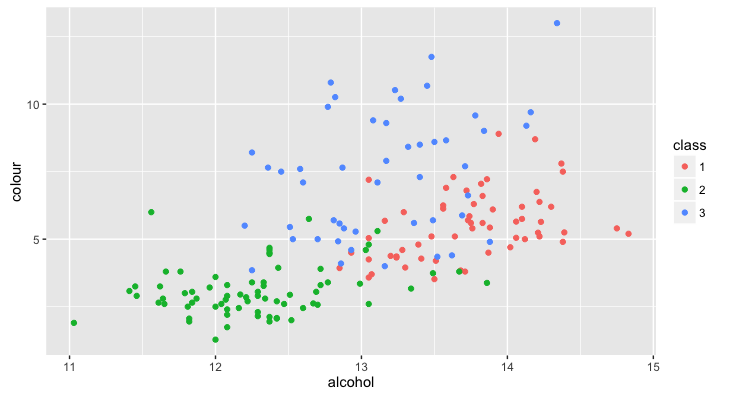
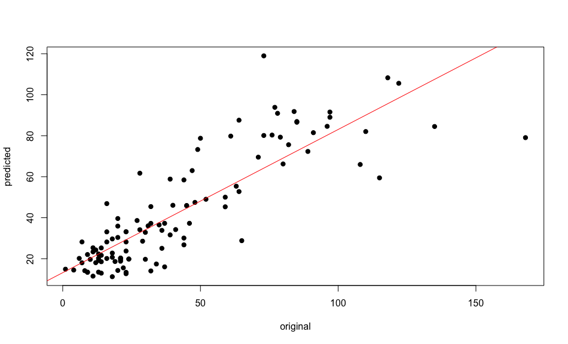
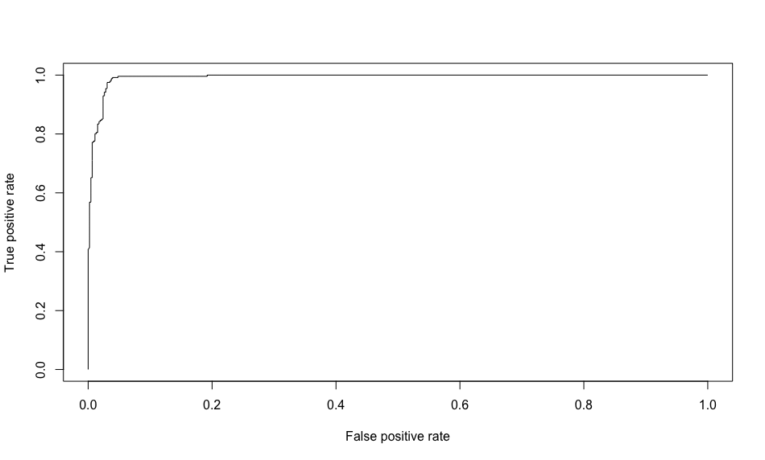

# Introduction

The Random Forest method is based on [decision trees](https://en.wikipedia.org/wiki/Decision_tree); hundreds of them. A decision tree can be thought of as a flow chart that you follow through to classify a case; I have a [blog post](http://davetang.org/muse/2013/03/12/building-a-classification-tree-in-r/) on building a decision tree (a.k.a. classification tree) in R. To illustrate the process of building a Random Forest classifier, consider a two-dimensional dataset with _N_ cases (rows) that has _M_ variables (columns). The Random Forest algorithm will start building independent decision trees; the default number of trees is 500 in the randomForest R package. For each tree, a random subset of _n_ cases is sampled from all available _N_ cases; the cases not used in tree construction are the Out Of Bag (OOB) cases. However, unlike typical decision trees, at each node of a tree, a random number of _m_ variables is used to determine the decision at the node; _m_ is typically the square root of _M_ and the best split is calculated based on the _m_ variables. When classifying a new case, it is fed down each tree and is classified as a specific class or label. This procedure is carried out across all the trees in the ensemble and the majority class or label is assigned to the new case.

For more information read on...

# Terminology

From the glossary of this review: [Machine learning applications in genetics and genomics](http://www.ncbi.nlm.nih.gov/pubmed/25948244).

* Features/Predictors/Variables: Single measurements or descriptors of examples used in a machine learning task.
* Label: The target of a prediction task. In classification, the label is discrete (for example, 'expressed' or 'not expressed'); in regression, the label is of real value (for example, a gene expression value).
* Feature selection: The process of choosing a smaller set of features from a larger set, either before applying a machine learning method or as part of training.
* Sensitivity: (Also known as recall). The fraction of positive examples identified; it is given by the number of positive predictions that are correct divided by the total number of positive examples.
* Precision: The fraction of positive predictions that are correct; it is given by the number of positive predictions that are correct divided by the total number of positive predictions.
* Precision-recall curve: For a binary classifier applied to a given data set, a curve that plots precision (y axis) versus recall (x axis) for a variety of classification thresholds.

# More details

In the introduction, I have outlined the main concept behind the Random Forest algorithm; this section provides more information.

The name Random Forest kinda describes the method; a forest is made up of trees and these trees are randomly build. We have a dataset and a random subset (using bootstrap resampling) of it is used to build a decision tree; this sample is typically half of the dataset. This process is repeated again to create a second random subset that is used to build a second decision tree. Since these are random subsets, the predictions made by the second tree should be different from the first tree. At the end, we will have hundreds of trees (a forest) each built from a slightly different subsets of the dataset and each generating different predictions. To add more randomness to the trees, a subset of candidate features/predictors/variables are used to produce a split in a decision tree. For example, if there were 100 predictors, a random subset of 10 will be used at each node to define the best split, instead of the full set of 100. Note that a new random subset of predictors are used at each node; this is different from selecting a random subset of predictors and using that random subset to build the entire tree. The number of predictors to consider at each node is a key parameter and it is recommended that empirical tests be conducted to find the best value; the square root of the number of available predictors is usually recommended as a good starting point. Finally, averaging or majority voting are used to combine all the separate predictions made by the individual trees.

Each tree in a Random Forest was built using a random subset and thus we automatically have holdout data for that particular tree; this is known as "Out Of Bag" (OOB) data. Every case in the full dataset will be "in bag" for some trees and "out of bag" for other trees; this is used to evaluate the Random Forest classifier. For example, if a particular case, _x_, was used in 250 trees and not used in another 250 trees, we can apply _x_ to the trees that didn't use it for training. Since _x_ was never used to generate any of the 250 trees, the result provides an assessment of the reliability of the Random Forest classifier. This can be carried out across all the cases in the dataset. Due to this OOB feature in the Random Forest algorithm, we do not need to create an additional holdout or testing dataset.

The Random Forest method also provides a measure of how close each case is to another case in the dataset, which is known as the "proximity". The procedure for calculating the proximity of two cases is to drop a pair of records down each individual tree in a Random Forest, and counting the number of times the two cases end up at the same terminal node, i.e. the same classification, and dividing by the number of trees tested. By carrying out this step across all pairs of cases, a proximity can be constructed. The proximity matrix provides a measure of how similar any two cases are in a dataset. One can perform hierarchical clustering on the proximity matrix to examine the underlying structure of a dataset.

Another useful feature of the Random Forest method is its estimation of relative predictor importance. The method is based on measuring the effect of the classifier if one of the predictors was removed. This is performed by randomly scrambling the values associated to a given predictor; the scrambling is done by moving values from a specific row to another row. The scrambling is performed one predictor at a time and predictive accuracy is measured for each predictor to obtain an estimation of relative predictor importance; note that the data is re-scramble for each predictor being tested.

# Classification and Regression Trees

* <http://www.stat.wisc.edu/~loh/treeprogs/guide/wires11.pdf>

# Classifying wines

Refer to the R Markdown file, [random_forest.Rmd](https://github.com/davetang/learning_random_forest/blob/master/random_forest.Rmd), for more information.

* Classifying wines from this [dataset](http://archive.ics.uci.edu/ml/datasets/Wine).
* There are 13 features/predictors/variables, which are the results of a chemical analysis of wines
* There are three labels, representing three different [cultivars](https://en.wikipedia.org/wiki/Cultivar)
* We can build a Random Forest classifier to classify wines based on their 13 features
* Related blog post <http://davetang.org/muse/2012/12/20/random-forests-in-predicting-wines/>

~~~~{.r}
install.packages("randomForest")
library(randomForest)

# preparing the data
data_url <- 'http://archive.ics.uci.edu/ml/machine-learning-databases/wine/wine.data'
df <- read.table(file=url(data_url), header=FALSE, sep=",")
header <- c('class',
            'alcohol',
            'malic_acid',
            'ash',
            'ash_alcalinity',
            'magnesium',
            'total_phenols',
            'flavanoids',
            'nonflavanoid_phenols',
            'proanthocyanins',
            'colour',
            'hue',
            'od280_od315',
            'proline')
names(df) <- header
df$class <- as.factor(df$class)

# analysis
# install if necessary
# install.packages("randomForest")
library(randomForest)

set.seed(31)
my_sample <- sort(sample(x = 1:nrow(df), replace = FALSE, size = nrow(df)/2))
my_sample_comp <- setdiff(1:nrow(df), my_sample)

test <- df[my_sample, ]
train <- df[my_sample_comp, ]

r <- randomForest(class ~ ., data=train, importance=TRUE, do.trace=100)

# plots
# install if necessary
# install.packages(ggplot2)
library(ggplot2)
class_1_importance <- data.frame(feature=names(r$importance[,1]), importance=r$importance[,1])
ggplot(class_1_importance, aes(x=feature, y=importance)) + geom_bar(stat="identity")

class_2_importance <- data.frame(feature=names(r$importance[,2]), importance=r$importance[,2])
ggplot(class_2_importance, aes(x=feature, y=importance)) + geom_bar(stat="identity")

class_3_importance <- data.frame(feature=names(r$importance[,3]), importance=r$importance[,3])
ggplot(class_2_importance, aes(x=feature, y=importance)) + geom_bar(stat="identity")

boxplot(df$colour ~ df$class, main="Colour by class")
boxplot(df$alcohol ~ df$class, main="Alcohol by class")

ggplot(df, aes(x=alcohol, y=colour, colour=class)) + geom_point()
~~~~

~~~~{.r}
varImpPlot(r)
~~~~

# Regression

Using the `airquality` dataset that comes with base R

~~~~{.r}
library(randomForest)

data(airquality)
head(airquality)
#   Ozone Solar.R Wind Temp Month Day
# 1    41     190  7.4   67     5   1
# 2    36     118  8.0   72     5   2
# 3    12     149 12.6   74     5   3
# 4    18     313 11.5   62     5   4
# 5    NA      NA 14.3   56     5   5
# 6    28      NA 14.9   66     5   6

# following the example from ?randomForest
ozone.rf <- randomForest(Ozone ~ ., data=airquality, mtry=3, importance=TRUE, na.action=na.omit)
print(ozone.rf)
# 
# Call:
#  randomForest(formula = Ozone ~ ., data = airquality, mtry = 3,      importance = TRUE, na.action = na.omit) 
#                Type of random forest: regression
#                      Number of trees: 500
# No. of variables tried at each split: 3
# 
#           Mean of squared residuals: 303.8304
#                     % Var explained: 72.31

# predicted values
predicted <- ozone.rf$predicted

# original values
# not all the original values were predicted
# hence we need to subset based on what was predicted
original  <- airquality$Ozone[sort(as.numeric(names(ozone.rf$predicted)))]

# fit a linear model
# Y ~ X, where Y is the dependent variable and X is the independent variable
fit       <- lm(predicted~original)
summary(fit)
#
# Call:
# lm(formula = predicted ~ original)
# 
# Residuals:
#     Min      1Q  Median      3Q     Max 
# -51.512  -7.919  -1.074   6.660  54.777 
# 
# Coefficients:
#             Estimate Std. Error t value Pr(>|t|)    
# (Intercept)  13.1775     2.2126   5.956 3.22e-08 ***
# original      0.6988     0.0413  16.919  < 2e-16 ***
# ---
# Signif. codes:  0 ‘***’ 0.001 ‘**’ 0.01 ‘*’ 0.05 ‘.’ 0.1 ‘ ’ 1
# 
# Residual standard error: 14.41 on 109 degrees of freedom
# Multiple R-squared:  0.7242,	Adjusted R-squared:  0.7217 
# F-statistic: 286.3 on 1 and 109 DF,  p-value: < 2.2e-16

plot(original, predicted, pch=19)
abline(fit, col=2)
~~~~

# Random Forest on breast cancer data

~~~~{.r}
library(randomForest)

data_url <- 'http://archive.ics.uci.edu/ml/machine-learning-databases/breast-cancer-wisconsin/breast-cancer-wisconsin.data'
df <- read.table(file=url(data_url), header=FALSE, sep=',')

colnames(df) <- c('sample_code_number',
                  'clump_thickness',
                  'uniformity_of_cell_size',
                  'uniformity_of_cell_shape',
                  'marginal_adhesion',
                  'single_epithelial_cell_size',
                  'bare_nuclei',
                  'bland_chromatin',
                  'normal_nucleoli',
                  'mitoses',
                  'class')

# remove sample code number
df <- df[,-1]

# change the class
# 2 for benign will be 0 and
# 4 for malignant will be 1
df$class <- factor(ifelse(df$class==4, 1, 0))

r <- randomForest(class ~ ., data=df, importance=TRUE, proximity=TRUE)

print(r)
# 
# Call:
#  randomForest(formula = class ~ ., data = df, importance = TRUE,      proximity = TRUE, do.trace = 100) 
#                Type of random forest: classification
#                      Number of trees: 500
# No. of variables tried at each split: 3
# 
#         OOB estimate of  error rate: 3.15%
# Confusion matrix:
#     0   1 class.error
# 0 443  15  0.03275109
# 1   7 234  0.02904564

library(ROCR)

# use votes, which are the fraction of (OOB) votes from the random forest
# in the first row, all trees voted for class 0, which is benign
head(r$votes)
#           0          1
# 1 1.0000000 0.00000000
# 2 0.1222222 0.87777778
# 3 1.0000000 0.00000000
# 4 0.1123596 0.88764045
# 5 0.9940828 0.00591716
# 6 0.0000000 1.00000000

pred <- prediction(r$votes[,2], as.numeric(df$class)-1)
perf <- performance(pred,"tpr","fpr")
plot(perf)

# Area under the curve
auc <- performance(pred, measure = "auc")
auc@y.values

legend('bottomright', legend = paste("AUC = ", auc@y.values))
~~~~

# Parallelisation

The `combine()` function in `randomForest` allows us to combine an ensemble of trees. Using the `doSNOW` and `foreach` packages, we can train several forests in parallel and combine them.

~~~~{.r}
library(randomForest)

# http://archive.ics.uci.edu/ml/datasets/Letter+Recognition
# 20,000 by 16 dataset
data_url <- 'http://archive.ics.uci.edu/ml/machine-learning-databases/letter-recognition/letter-recognition.data'
df <- read.table(file=url(data_url), header=FALSE, sep=',')
colnames(df) <- c('class', 'xbox', 'ybox', 'width', 'high', 'onpix', 'xbar', 'ybar', 'x2bar', 'y2bar', 'xybar', 'x2ybr', 'xy2br', 'xege', 'xegvy', 'yege', 'yegvx')

system.time(r <- randomForest(class ~ ., data=df, importance=TRUE, do.trace=100, proximity=TRUE))
# ntree      OOB      1      2      3      4      5      6      7      8      9     10     11     12     13     14     15     16     17     18     19     20     21     22     23     24     25     26
#   100:   3.58%  0.63%  3.79%  3.67%  2.61%  4.17%  5.55%  4.40%  8.72%  4.90%  5.22%  7.04%  2.76%  1.26%  3.96%  3.85%  4.36%  3.45%  4.35%  2.94%  2.39%  1.48%  3.80%  2.13%  2.16%  2.04%  2.32%
#   200:   3.16%  0.25%  3.26%  3.12%  2.36%  3.78%  4.65%  3.75%  7.36%  4.90%  4.28%  6.09%  2.37%  1.39%  3.96%  3.45%  3.86%  3.19%  4.75%  2.94%  1.88%  1.35%  3.14%  0.80%  2.16%  1.53%  2.18%
#   300:   3.25%  0.38%  3.39%  3.40%  2.61%  4.17%  4.65%  3.49%  7.90%  4.64%  4.69%  5.82%  2.50%  1.14%  3.83%  3.45%  4.11%  2.94%  4.75%  2.81%  2.01%  1.60%  3.40%  1.33%  2.29%  1.53%  2.32%
#   400:   3.11%  0.51%  3.00%  2.58%  2.36%  4.17%  4.77%  3.49%  7.77%  4.90%  4.55%  5.82%  2.10%  1.14%  3.70%  3.19%  4.11%  3.19%  4.22%  2.67%  1.88%  1.60%  3.53%  0.80%  1.78%  1.53%  2.04%
#   500:   3.09%  0.51%  2.87%  2.85%  2.98%  3.91%  4.52%  3.49%  7.63%  5.03%  4.82%  5.55%  1.97%  1.14%  3.96%  3.05%  3.74%  2.94%  4.35%  2.67%  1.63%  1.72%  3.40%  0.93%  1.78%  1.53%  1.91%
#    user  system elapsed
# 460.992  44.084 505.639

library(foreach)
library(doSNOW)
registerDoSNOW(makeCluster(5, type='SOCK'))

system.time(rf <- foreach(ntree = rep(100, 5), .combine = combine, .packages = "randomForest") %dopar%  randomForest(class ~ ., data=df, proximity=TRUE, importance=TRUE, ntree = ntree))
#    user  system elapsed
#  48.856  99.192 265.819

# faster parallelisation by using .multicombine=TRUE
# see http://stackoverflow.com/questions/14106010/parallel-execution-of-random-forest-in-r
system.time(rfm <- foreach(ntree = rep(100, 5), .combine = combine, .multicombine=TRUE, .packages = "randomForest") %dopar%  randomForest(class ~ ., data=df, proximity=TRUE, importance=TRUE, ntree = ntree))
#   user  system elapsed
# 30.404  49.052 200.325

length(names(r))
# [1] 19

length(names(rf))
# [1] 17

# as noted in the documentation of the Random Forest package under combine
# The confusion, err.rate, mse and rsq components (as well as the corresponding
# components in the test compnent, if exist) of the combined object will be NULL.
setdiff(names(r), names(rf))
# [1] "err.rate"  "confusion"

# we can generate the confusion matrix using table()
table(df$class, r$predicted)

# error rate
table(df$class == r$predicted)
#
# FALSE  TRUE 
#   628 19372
# as a percentage
(1 - (unname(table(df$class == r$predicted)[2]) / length(r$predicted))) * 100
# [1] 3.14
~~~~

# Proximity

Proximity is calculated by tallying the number of times a pair of records ends up at the same terminal node for each tree.

~~~~{.r}
library(randomForest)

data_url <- 'http://archive.ics.uci.edu/ml/machine-learning-databases/letter-recognition/letter-recognition.data'
df <- read.table(file=url(data_url), header=FALSE, sep=',')
colnames(df) <- c('class', 'xbox', 'ybox', 'width', 'high', 'onpix', 'xbar', 'ybar', 'x2bar', 'y2bar', 'xybar', 'x2ybr', 'xy2br', 'xege', 'xegvy', 'yege', 'yegvx')
r <- randomForest(class ~ ., data=df, importance=TRUE, proximity=TRUE)

# proximity matrix
mat <- r$proximity
# name the rows and columns
rownames(mat) <- df$class
colnames(mat) <- df$class

# use the which() function to calculate a
# matrix of which elements in the proximity matrix
# are greater than 0.5 but not 1
w <- which(mat > 0.5 & mat != 1, arr.ind = TRUE)

# function to retrieve row and column names
# from the w matrix
get_row_col <- function(x, m){
  my_row <- rownames(m)[x[1]]
  my_col <- colnames(m)[x[2]]
  paste(my_row, my_col, sep = ':')
}

table(unname(apply(w, 1, get_row_col, m=mat)))

#    A:A    A:G    B:B    B:H    C:C    D:D    D:H    D:O    E:E    E:G    E:K    E:L    E:S    E:Z    F:F    F:P    G:A 
# 191944      1  14124      1  26514  10512     18      2  28560      4      1      2      1      1  18276     13      1 
#    G:E    G:G    H:B    H:D    H:H    H:K    I:I    I:J    J:I    J:J    K:E    K:H    K:K    K:R    K:X    L:E    L:L 
#      4  10492      1     18  26694      4  81548     18     18  61394      1      4  13878      2      1      2 109546 
#    M:M    M:V    N:N    O:D    O:O    O:Q    P:F    P:P    Q:O    Q:Q    Q:Z    R:K    R:R    S:E    S:S    T:T    T:Y 
#  49488      3  41938      2  12528      7     13  37994      7   6286      1      2  13730      1  10212  42168     13 
#    U:U    V:M    V:V    V:W    V:Y    W:V    W:W    X:K    X:X    Y:T    Y:V    Y:Y    Z:E    Z:Q    Z:Z 
#  77194      3  48160      7    103      7  52370      1  18088     13    103  23840      1      1  55088
~~~~

Out of all the mismatches, V's and Y's tended to end up together the most often.

# Further reading

* [Machine learning 101](http://www.astroml.org/sklearn_tutorial/general_concepts.html)
* [Some Things Every Biologist Should Know About Machine Learning](http://www.bioconductor.org/help/course-materials/2003/Milan/Lectures/MachineLearning.pdf)
* Decision tree learning on [Wikipedia](https://en.wikipedia.org/wiki/Decision_tree_learning)
* [An introduction to ROC analysis](https://ccrma.stanford.edu/workshops/mir2009/references/ROCintro.pdf)
* [A small introduction to the ROCR package](https://hopstat.wordpress.com/2014/12/19/a-small-introduction-to-the-rocr-package/)
* [Identifying Mendelian disease genes with the variant effect scoring tool](http://www.ncbi.nlm.nih.gov/pubmed/23819870)

