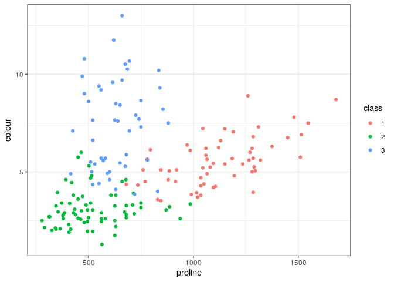

## Getting started

Install and load packages used in this notebook.

``` r
my_packages <- c('randomForest', 'ggplot2')

for (my_package in my_packages){
   if(!require(my_package, character.only = TRUE)){
      install.packages(my_package, '/packages')
   }
  library(my_package, character.only = TRUE)
}
```

    ## Loading required package: randomForest

    ## randomForest 4.7-1.1

    ## Type rfNews() to see new features/changes/bug fixes.

    ## Loading required package: ggplot2

    ## 
    ## Attaching package: 'ggplot2'

    ## The following object is masked from 'package:randomForest':
    ## 
    ##     margin

## Preparing the data

We will use the [Wine data
set](https://archive.ics.uci.edu/ml/datasets/wine).

``` r
my_url <- 'https://archive.ics.uci.edu/ml/machine-learning-databases/wine/wine.data'

wine_df <- read.csv(
  file = url(my_url),
  header=FALSE
)

colnames(wine_df) <- c(
  'class',
  'alcohol',
  'malic_acid',
  'ash',
  'ash_alcalinity',
  'magnesium',
  'total_phenols',
  'flavanoids',
  'nonflavanoid_phenols',
  'proanthocyanins',
  'colour',
  'hue',
  'od280_od315',
  'proline'
)

wine_df$class <- as.factor(wine_df$class)

table(wine_df$class)
```

    ## 
    ##  1  2  3 
    ## 59 71 48

## Training

First we'll split the data into a training (80%) and testing set (20%).

``` r
set.seed(1984)
idx <- sample(x = 1:nrow(wine_df), size = nrow(wine_df)*0.8)

train <- wine_df[idx, ]
test <- wine_df[-idx, ]

dim(train)
```

    ## [1] 142  14

``` r
dim(test)
```

    ## [1] 36 14

Train a random forests model, where:

-   `data` - an optional data frame containing the variables in the
    model
-   `importance` - calculate the importance of predictors
-   `do.trace` - give a more verbose output as randomForest is running
-   `proximity` - calculate the proximity measure among the rows

``` r
rf <- randomForest(
  class ~ .,
  data = train,
  importance = TRUE,
  do.trace = 100,
  proximity = TRUE
)
```

    ## ntree      OOB      1      2      3
    ##   100:   3.52%  2.27%  6.56%  0.00%
    ##   200:   2.82%  2.27%  4.92%  0.00%
    ##   300:   2.82%  2.27%  4.92%  0.00%
    ##   400:   3.52%  2.27%  6.56%  0.00%
    ##   500:   2.82%  2.27%  4.92%  0.00%

Summary.

``` r
rf
```

    ## 
    ## Call:
    ##  randomForest(formula = class ~ ., data = train, importance = TRUE,      do.trace = 100, proximity = TRUE) 
    ##                Type of random forest: classification
    ##                      Number of trees: 500
    ## No. of variables tried at each split: 3
    ## 
    ##         OOB estimate of  error rate: 2.82%
    ## Confusion matrix:
    ##    1  2  3 class.error
    ## 1 43  1  0  0.02272727
    ## 2  1 58  2  0.04918033
    ## 3  0  0 37  0.00000000

## Plots

Variable importance plot.

``` r
varImpPlot(rf)
```


We can see a nice separation in the classes by plotting proline versus
colour.

``` r
ggplot(wine_df, aes(x = proline, y = colour, colour = class)) +
  geom_point() +
  theme_bw()
```



## Inspecting the Random Forest object

The model is saved as a `randomForest` class.

``` r
class(rf)
```

    ## [1] "randomForest.formula" "randomForest"

The object is a list containing the model's settings, predictions, and
other information.

``` r
str(rf)
```

    ## List of 19
    ##  $ call           : language randomForest(formula = class ~ ., data = train, importance = TRUE, do.trace = 100,      proximity = TRUE)
    ##  $ type           : chr "classification"
    ##  $ predicted      : Factor w/ 3 levels "1","2","3": 3 3 2 3 2 1 2 3 1 2 ...
    ##   ..- attr(*, "names")= chr [1:142] "168" "148" "78" "160" ...
    ##  $ err.rate       : num [1:500, 1:4] 0.1321 0.1279 0.1182 0.0924 0.088 ...
    ##   ..- attr(*, "dimnames")=List of 2
    ##   .. ..$ : NULL
    ##   .. ..$ : chr [1:4] "OOB" "1" "2" "3"
    ##  $ confusion      : num [1:3, 1:4] 43 1 0 1 58 ...
    ##   ..- attr(*, "dimnames")=List of 2
    ##   .. ..$ : chr [1:3] "1" "2" "3"
    ##   .. ..$ : chr [1:4] "1" "2" "3" "class.error"
    ##  $ votes          : 'matrix' num [1:142, 1:3] 0.00571 0 0.01546 0.05435 0 ...
    ##   ..- attr(*, "dimnames")=List of 2
    ##   .. ..$ : chr [1:142] "168" "148" "78" "160" ...
    ##   .. ..$ : chr [1:3] "1" "2" "3"
    ##  $ oob.times      : num [1:142] 175 178 194 184 187 198 194 175 153 166 ...
    ##  $ classes        : chr [1:3] "1" "2" "3"
    ##  $ importance     : num [1:13, 1:5] 0.15795 0.01087 0.00224 0.01999 0.04333 ...
    ##   ..- attr(*, "dimnames")=List of 2
    ##   .. ..$ : chr [1:13] "alcohol" "malic_acid" "ash" "ash_alcalinity" ...
    ##   .. ..$ : chr [1:5] "1" "2" "3" "MeanDecreaseAccuracy" ...
    ##  $ importanceSD   : num [1:13, 1:4] 0.00874 0.00193 0.00121 0.00314 0.00448 ...
    ##   ..- attr(*, "dimnames")=List of 2
    ##   .. ..$ : chr [1:13] "alcohol" "malic_acid" "ash" "ash_alcalinity" ...
    ##   .. ..$ : chr [1:4] "1" "2" "3" "MeanDecreaseAccuracy"
    ##  $ localImportance: NULL
    ##  $ proximity      : num [1:142, 1:142] 1 0.9344 0.0959 0.6515 0.0156 ...
    ##   ..- attr(*, "dimnames")=List of 2
    ##   .. ..$ : chr [1:142] "168" "148" "78" "160" ...
    ##   .. ..$ : chr [1:142] "168" "148" "78" "160" ...
    ##  $ ntree          : num 500
    ##  $ mtry           : num 3
    ##  $ forest         :List of 14
    ##   ..$ ndbigtree : int [1:500] 25 23 17 19 19 19 21 19 15 29 ...
    ##   ..$ nodestatus: int [1:35, 1:500] 1 1 1 -1 1 1 1 1 -1 -1 ...
    ##   ..$ bestvar   : int [1:35, 1:500] 1 12 11 0 10 12 5 9 0 0 ...
    ##   ..$ treemap   : int [1:35, 1:2, 1:500] 2 4 6 0 8 10 12 14 0 0 ...
    ##   ..$ nodepred  : int [1:35, 1:500] 0 0 0 3 0 0 0 0 3 3 ...
    ##   ..$ xbestsplit: num [1:35, 1:500] 12.735 1.57 0.795 0 7.105 ...
    ##   ..$ pid       : num [1:3] 1 1 1
    ##   ..$ cutoff    : num [1:3] 0.333 0.333 0.333
    ##   ..$ ncat      : Named int [1:13] 1 1 1 1 1 1 1 1 1 1 ...
    ##   .. ..- attr(*, "names")= chr [1:13] "alcohol" "malic_acid" "ash" "ash_alcalinity" ...
    ##   ..$ maxcat    : int 1
    ##   ..$ nrnodes   : int 35
    ##   ..$ ntree     : num 500
    ##   ..$ nclass    : int 3
    ##   ..$ xlevels   :List of 13
    ##   .. ..$ alcohol             : num 0
    ##   .. ..$ malic_acid          : num 0
    ##   .. ..$ ash                 : num 0
    ##   .. ..$ ash_alcalinity      : num 0
    ##   .. ..$ magnesium           : num 0
    ##   .. ..$ total_phenols       : num 0
    ##   .. ..$ flavanoids          : num 0
    ##   .. ..$ nonflavanoid_phenols: num 0
    ##   .. ..$ proanthocyanins     : num 0
    ##   .. ..$ colour              : num 0
    ##   .. ..$ hue                 : num 0
    ##   .. ..$ od280_od315         : num 0
    ##   .. ..$ proline             : num 0
    ##  $ y              : Factor w/ 3 levels "1","2","3": 3 3 2 3 2 1 2 3 1 2 ...
    ##   ..- attr(*, "names")= chr [1:142] "168" "148" "78" "160" ...
    ##  $ test           : NULL
    ##  $ inbag          : NULL
    ##  $ terms          :Classes 'terms', 'formula'  language class ~ alcohol + malic_acid + ash + ash_alcalinity + magnesium + total_phenols +      flavanoids + nonflavanoid_| __truncated__ ...
    ##   .. ..- attr(*, "variables")= language list(class, alcohol, malic_acid, ash, ash_alcalinity, magnesium, total_phenols,      flavanoids, nonflavanoid_phe| __truncated__ ...
    ##   .. ..- attr(*, "factors")= int [1:14, 1:13] 0 1 0 0 0 0 0 0 0 0 ...
    ##   .. .. ..- attr(*, "dimnames")=List of 2
    ##   .. .. .. ..$ : chr [1:14] "class" "alcohol" "malic_acid" "ash" ...
    ##   .. .. .. ..$ : chr [1:13] "alcohol" "malic_acid" "ash" "ash_alcalinity" ...
    ##   .. ..- attr(*, "term.labels")= chr [1:13] "alcohol" "malic_acid" "ash" "ash_alcalinity" ...
    ##   .. ..- attr(*, "order")= int [1:13] 1 1 1 1 1 1 1 1 1 1 ...
    ##   .. ..- attr(*, "intercept")= num 0
    ##   .. ..- attr(*, "response")= int 1
    ##   .. ..- attr(*, ".Environment")=<environment: R_GlobalEnv> 
    ##   .. ..- attr(*, "predvars")= language list(class, alcohol, malic_acid, ash, ash_alcalinity, magnesium, total_phenols,      flavanoids, nonflavanoid_phe| __truncated__ ...
    ##   .. ..- attr(*, "dataClasses")= Named chr [1:14] "factor" "numeric" "numeric" "numeric" ...
    ##   .. .. ..- attr(*, "names")= chr [1:14] "class" "alcohol" "malic_acid" "ash" ...
    ##  - attr(*, "class")= chr [1:2] "randomForest.formula" "randomForest"

`call` contains the original call to `randomForest`.

``` r
rf$call
```

    ## randomForest(formula = class ~ ., data = train, importance = TRUE, 
    ##     do.trace = 100, proximity = TRUE)

`type` shows the model type: one of regression, classification, or
unsupervised.

``` r
rf$type
```

    ## [1] "classification"

`predicted` contains the predicted values of the input data based on
out-of-bag samples.

``` r
rf$predicted
```

    ## 168 148  78 160 115  17  68 164  38 109   2 121  86  41 176 155  75  21 177  26 
    ##   3   3   2   3   2   1   2   3   1   2   1   2   2   1   3   3   2   1   3   1 
    ## 175  60  32  37  29   8   6  72  91  84 104 169  98  90  80  34  27 162  74  96 
    ##   3   2   1   1   1   1   1   2   2   3   2   3   2   2   2   1   1   3   1   2 
    ##  63  81 111 117 120  14 167 142 106 163  67  62 147  48 126 119  39  16  64 173 
    ##   2   2   2   2   2   1   3   3   2   3   2   3   3   1   2   2   1   1   2   3 
    ## 129  20  44 157 174 103  33 128 161  94   7 102  40 159   3 140 145  79  57   1 
    ##   2   1   2   3   3   2   1   2   3   2   1   2   1   3   1   3   3   2   1   1 
    ##  42  73 134  88  50 124 112  99  55  53  35 144 116 114   4 170  24  43  11   5 
    ##   1   2   3   2   1   2   2   2   1   1   1   3   2   2   1   3   1   1   1   1 
    ## 107  71 123 141  83  97  85 172 110 146  82  58 152 165 153  93 130 122 127  54 
    ##   2   2   2   3   2   2   2   3   2   3   2   1   3   3   3   2   2   2   2   1 
    ##  10  95  65  89 151  23 150 118  61  76 149 131 137  15 101   9  36  52 171 133 
    ##   1   2   2   2   3   1   3   2   2   2   3   3   3   1   2   1   1   1   3   3 
    ##  25  92 
    ##   1   2 
    ## Levels: 1 2 3

`importance` contains a matrix with number of classes + 2 (for
classification) or two (for regression) columns. For our example, the
first three columns are the class-specific measures computed as mean
descrease in accuracy. The last two columns are the
`MeanDecreaseAccuracy`, which is the mean decrease in accuracy over all
classes and the `MeanDecreaseGini`, which is the mean decrease in Gini
index.

``` r
rf$importance
```

    ##                                1             2           3 MeanDecreaseAccuracy
    ## alcohol              0.157950068  0.0649192698 0.016450711          0.080397710
    ## malic_acid           0.010874531  0.0036986631 0.016216927          0.009243197
    ## ash                  0.002243164  0.0052738614 0.009940309          0.005548792
    ## ash_alcalinity       0.019987398  0.0022507477 0.025508873          0.013952446
    ## magnesium            0.043333942  0.0106928077 0.002305518          0.018362866
    ## total_phenols        0.093033162 -0.0027198633 0.035197144          0.036115317
    ## flavanoids           0.145411585  0.0186774305 0.209634161          0.104797346
    ## nonflavanoid_phenols 0.003778049 -0.0001248384 0.003386331          0.002074381
    ## proanthocyanins      0.010706209  0.0001758991 0.020812541          0.008894058
    ## colour               0.109596149  0.0881773812 0.130802366          0.104982179
    ## hue                  0.043625855  0.0222891264 0.122800525          0.054192975
    ## od280_od315          0.091484310  0.0110604465 0.158676981          0.074187209
    ## proline              0.238831152  0.0491722177 0.031944572          0.102621640
    ##                      MeanDecreaseGini
    ## alcohol                    13.0030808
    ## malic_acid                  2.4627874
    ## ash                         1.5501539
    ## ash_alcalinity              3.1409504
    ## magnesium                   3.0110573
    ## total_phenols               4.9195549
    ## flavanoids                 14.2007379
    ## nonflavanoid_phenols        0.9439355
    ## proanthocyanins             1.8474937
    ## colour                     14.8165670
    ## hue                         8.2848109
    ## od280_od315                10.1582018
    ## proline                    13.4903870

`importanceSD` contains the "standard errors" of the permutation-based
importance measure.

``` r
rf$importanceSD
```

    ##                                1           2           3 MeanDecreaseAccuracy
    ## alcohol              0.008741382 0.004521433 0.002834624         0.0041098728
    ## malic_acid           0.001932147 0.001250649 0.002718250         0.0012675867
    ## ash                  0.001207542 0.001135261 0.001783831         0.0008025541
    ## ash_alcalinity       0.003140485 0.001421578 0.003423911         0.0015321357
    ## magnesium            0.004477435 0.001692480 0.001396576         0.0017895183
    ## total_phenols        0.007968376 0.001296144 0.004048676         0.0029948758
    ## flavanoids           0.008958937 0.002809516 0.011173745         0.0049940686
    ## nonflavanoid_phenols 0.001083426 0.000665085 0.001258994         0.0006283408
    ## proanthocyanins      0.002280513 0.001052956 0.003102117         0.0012238284
    ## colour               0.007053419 0.005110829 0.007519527         0.0048282033
    ## hue                  0.004316607 0.002556133 0.007839363         0.0032010333
    ## od280_od315          0.006785319 0.002503907 0.010100710         0.0042955471
    ## proline              0.010900739 0.003903854 0.004065815         0.0046027020

`ntree` shows the number of trees grown.

``` r
rf$ntree
```

    ## [1] 500

`mtry` shows the number of predictors sampled for splitting at each node
of an independent tree.

``` r
rf$mtry
```

    ## [1] 3

`forest` is a list that contains the entire forest, i.e. every grown
tree.

``` r
names(rf$forest)
```

    ##  [1] "ndbigtree"  "nodestatus" "bestvar"    "treemap"    "nodepred"  
    ##  [6] "xbestsplit" "pid"        "cutoff"     "ncat"       "maxcat"    
    ## [11] "nrnodes"    "ntree"      "nclass"     "xlevels"

We can use `getTree` to obtain an individual tree. The returned value is
a matrix (or data frame, if `labelVar=TRUE`) with six columns and number
of rows equal to total number of nodes in the tree. The six columns are:

1.  left daughter - the row where the left daughter node is; 0 if the
    node is terminal
2.  right daughter - the row where the right daughter node is; 0 if the
    node is terminal
3.  split var - which variable was used to split the node; 0 if the node
    is terminal
4.  split point - where the best split is; see Details for categorical
    predictor
5.  status - is the node terminal (-1) or not (1)
6.  prediction - the prediction for the node; 0 if the node is not
    terminal

``` r
getTree(rf, k = 500, labelVar = TRUE)
```

    ##    left daughter right daughter   split var split point status prediction
    ## 1              2              3         hue       0.780      1       <NA>
    ## 2              4              5  flavanoids       2.075      1       <NA>
    ## 3              6              7  flavanoids       2.350      1       <NA>
    ## 4              8              9 od280_od315       2.020      1       <NA>
    ## 5              0              0        <NA>       0.000     -1          2
    ## 6             10             11 od280_od315       1.615      1       <NA>
    ## 7             12             13     alcohol      13.155      1       <NA>
    ## 8              0              0        <NA>       0.000     -1          3
    ## 9             14             15  malic_acid       3.120      1       <NA>
    ## 10             0              0        <NA>       0.000     -1          3
    ## 11             0              0        <NA>       0.000     -1          2
    ## 12            16             17     proline    1045.000      1       <NA>
    ## 13            18             19     proline     545.000      1       <NA>
    ## 14             0              0        <NA>       0.000     -1          3
    ## 15             0              0        <NA>       0.000     -1          2
    ## 16             0              0        <NA>       0.000     -1          2
    ## 17             0              0        <NA>       0.000     -1          1
    ## 18             0              0        <NA>       0.000     -1          2
    ## 19             0              0        <NA>       0.000     -1          1

Summary depth of all trees.

``` r
summary(
  sapply(1:rf$ntree, function(x){
    nrow(getTree(rf, k = x))
  })
)
```

    ##    Min. 1st Qu.  Median    Mean 3rd Qu.    Max. 
    ##    9.00   17.00   19.00   18.96   21.00   35.00

`err.rate` contains error rates of the prediction on the input data, the
i-th element being the (OOB) error rate for all trees up to the i-th.

``` r
head(rf$err.rate)
```

    ##             OOB          1          2          3
    ## [1,] 0.13207547 0.14285714 0.09090909 0.17647059
    ## [2,] 0.12790698 0.08000000 0.11428571 0.19230769
    ## [3,] 0.11818182 0.06666667 0.14583333 0.12500000
    ## [4,] 0.09243697 0.09375000 0.09615385 0.08571429
    ## [5,] 0.08800000 0.11764706 0.08928571 0.05714286
    ## [6,] 0.09022556 0.15384615 0.08620690 0.02777778

`confusion` contains the confusion matrix of the prediction (based on
OOB data).

``` r
rf$confusion
```

    ##    1  2  3 class.error
    ## 1 43  1  0  0.02272727
    ## 2  1 58  2  0.04918033
    ## 3  0  0 37  0.00000000

`votes` is a matrix with one row for each input data point and one
column for each class, giving the fraction or number of (OOB) "votes"
from the random forest.

``` r
head(rf$votes)
```

    ##               1          2          3
    ## 168 0.005714286 0.01714286 0.97714286
    ## 148 0.000000000 0.03932584 0.96067416
    ## 78  0.015463918 0.83505155 0.14948454
    ## 160 0.054347826 0.10326087 0.84239130
    ## 115 0.000000000 1.00000000 0.00000000
    ## 17  0.949494949 0.02525253 0.02525253

`oob.times` contains the number of times cases are "out-of-bag" (and
thus used in computing OOB error estimate): around 36% of the time.

``` r
summary(rf$oob.times / rf$ntree)
```

    ##    Min. 1st Qu.  Median    Mean 3rd Qu.    Max. 
    ##  0.3060  0.3520  0.3660  0.3657  0.3815  0.4320

`proximity` contains a matrix of proximity measures among the input
(based on the frequency that pairs of data points are in the same
terminal nodes).

``` r
dim(rf$proximity)
```

    ## [1] 142 142

## On importance

Notes from [Stack
Exchange](http://stats.stackexchange.com/questions/92419/relative-importance-of-a-set-of-predictors-in-a-random-forests-classification-in%3E):

MeanDecreaseGini is a measure of variable importance based on the Gini
impurity index used for the calculation of splits during training. A
common misconception is that the variable importance metric refers to
the Gini used for asserting model performance which is closely related
to AUC, but this is wrong. Here is the explanation from the randomForest
package written by Breiman and Cutler:

> Every time a split of a node is made on variable m the gini impurity
> criterion for the two descendent nodes is less than the parent node.
> Adding up the gini decreases for each individual variable over all
> trees in the forest gives a fast variable importance that is often
> very consistent with the permutation importance measure.

The Gini impurity index is defined as:

$$ G = \sum^{n_c}_{i=1} p_i (1 - p_i) $$

where $n_c$ is the number of classes in the target variable and $p_i$ is
the ratio of this class.

## Session information

    ## R version 4.2.0 (2022-04-22)
    ## Platform: x86_64-pc-linux-gnu (64-bit)
    ## Running under: Ubuntu 20.04.4 LTS
    ## 
    ## Matrix products: default
    ## BLAS:   /usr/lib/x86_64-linux-gnu/openblas-pthread/libblas.so.3
    ## LAPACK: /usr/lib/x86_64-linux-gnu/openblas-pthread/liblapack.so.3
    ## 
    ## locale:
    ##  [1] LC_CTYPE=en_US.UTF-8       LC_NUMERIC=C              
    ##  [3] LC_TIME=en_US.UTF-8        LC_COLLATE=en_US.UTF-8    
    ##  [5] LC_MONETARY=en_US.UTF-8    LC_MESSAGES=en_US.UTF-8   
    ##  [7] LC_PAPER=en_US.UTF-8       LC_NAME=C                 
    ##  [9] LC_ADDRESS=C               LC_TELEPHONE=C            
    ## [11] LC_MEASUREMENT=en_US.UTF-8 LC_IDENTIFICATION=C       
    ## 
    ## attached base packages:
    ## [1] stats     graphics  grDevices utils     datasets  methods   base     
    ## 
    ## other attached packages:
    ## [1] ggplot2_3.4.0        randomForest_4.7-1.1
    ## 
    ## loaded via a namespace (and not attached):
    ##  [1] pillar_1.8.1     compiler_4.2.0   highr_0.9        tools_4.2.0     
    ##  [5] digest_0.6.30    evaluate_0.17    lifecycle_1.0.3  tibble_3.1.8    
    ##  [9] gtable_0.3.1     pkgconfig_2.0.3  rlang_1.0.6      cli_3.4.1       
    ## [13] DBI_1.1.3        rstudioapi_0.14  yaml_2.3.6       xfun_0.34       
    ## [17] fastmap_1.1.0    withr_2.5.0      stringr_1.4.1    dplyr_1.0.10    
    ## [21] knitr_1.40       generics_0.1.3   vctrs_0.5.0      grid_4.2.0      
    ## [25] tidyselect_1.2.0 glue_1.6.2       R6_2.5.1         fansi_1.0.3     
    ## [29] rmarkdown_2.17   farver_2.1.1     magrittr_2.0.3   scales_1.2.1    
    ## [33] htmltools_0.5.3  assertthat_0.2.1 colorspace_2.0-3 labeling_0.4.2  
    ## [37] utf8_1.2.2       stringi_1.7.8    munsell_0.5.0
